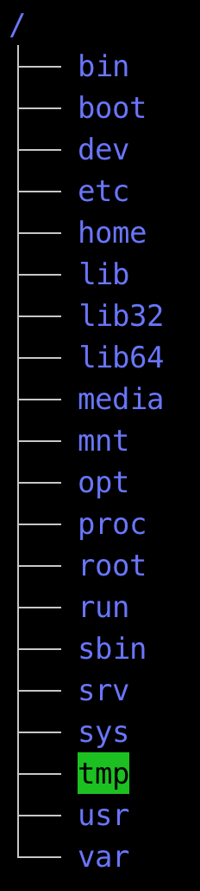
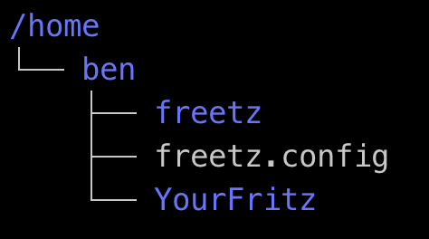
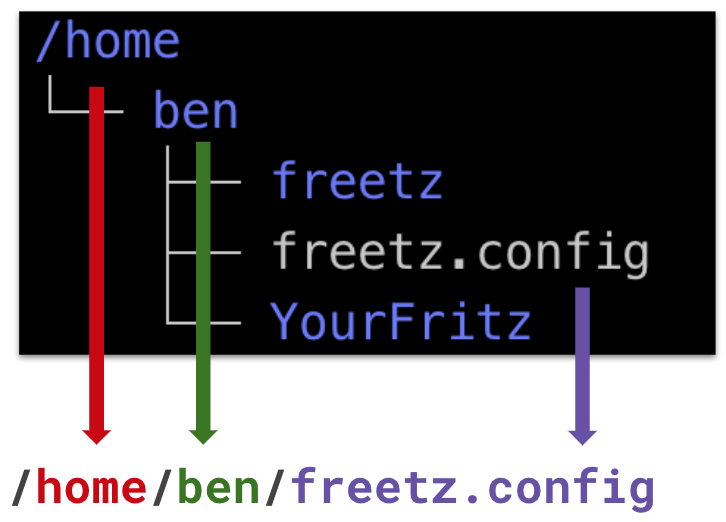

<!-- .slide: class="chapter" -->
# Filesystem
<br/><br/>

<!-- #### ... <span>|</span> `cd` <span>|</span> `ls` <span>|</span> `mkdir` <span>|</span> `rm` <span>|</span> ... -->

----

<!-- .element: class="plain" style="height: 24em" -->

notes:
* root /, slash als trenner
* aufgebaut als tree / hierarchisch


----

<!-- .slide: class="filesystem" -->
## Root Directories - System

* **`/bin`**, **`/lib`** & **`/sbin`** - System Binaries & Libraries

* **`/boot`** - Bootloader, Bootloader Config., EFI

* **`/etc`** - (Service) Configurations (Webserver, Filesystems, ...)

----

<!-- .slide: class="filesystem" -->
## Root Directories

* **`/home/<user>`** & **`/root`** - *$HOME* of Users and root

* **`/usr`**
  * **`/usr/bin`** - Binaries of Installed Apps
  * **`/usr/lib`** - Libraries of Installed Apps

* **`/opt`** - Manually Installed, Compiled from Source, ...

----

<!-- .slide: class="filesystem" -->
## Root Directories - Virtual

* **`/dev`** - Device-Files ("everything is a file")

* **`/proc`** & **`/sys`** - Low level System Configuration (be careful!)

* **`/run`** - PID-Files and other stuff of running processes

----

## Filesystem Path

<!-- .element: class="plain" style="height: 20em" -->

----

## Filesystem Path

 <!-- .element: class="plain" style="height: 20em" -->

----

<!-- .slide: class="paths" -->
## Absolute Paths
* **`/`**`home/user/workshop/zoi` <!-- .element: class="paths" -->
* **`~`**`/workshop/zoi`
* **`$HOME`**`/workshop/zoi`

 - - -

## Relative Paths
* `workshop/zoi`
* **`..`**`/workshop/zoi`

----

<!-- .slide: class="paths" -->
### Absolute Paths
* **`mkdir`** `/home/user/workshop/zoi` <!-- .element: class="paths" -->
* **`cd`** `~/workshop/zoi`
* **`ls`** `$HOME/workshop/zoi`

 - - -

### Relative Paths
* **`rm -r`** `workshop/zoi`
* **`ls`** `../workshop/zoi`

----

<!-- .slide: class="chapter" -->
# Permissions
<br/><br/>

```bash
$ ls -lh
-rw-r--r-- ... file1
drwxr-xr-x ... dir1
drwxr-xr-x ... dir2
```

----

<!-- .slide: class="chapter" -->
# Permissions
<br/><br/>

```bash
$ ls -lh
-  rw-  r--  r--  ... file1
d  rwx  r-x  r-x  ... dir1
d  rwx  r-x  r-x  ... dir2
```

----

<!-- .slide: class="chapter" -->
# Binary Numbers
<br/><br/>

```bash
 4 2 1  value
 0 0 1  binary
 - - -
     1  decimal
```

----

<!-- .slide: class="chapter" -->
# Binary Numbers
<br/><br/>

```bash
 4 2 1  value
 1 0 1  binary
 - - -
     5  decimal
```

----

<!-- .slide: class="chapter" -->
## Binary Numbers meet Permissions
<br/><br/>

```bash
 4 2 1  value
 1 0 1  binary
 r - x  permissions
 - - -
     5  decimal
```

----

<!-- .slide: class="chapter" -->
## Binary Numbers meet Permissions
<br/><br/>

```bash
 owner    group    world
 4 2 1    4 2 1    4 2 1  value
 1 1 0    1 0 0    1 0 0  binary
 r w -    r - -    r - -  permissions
 - - -    - - -    - - -
     6        4        4  decimal
```

----

# Permissions
<br/><br/>

```bash
$ stat utils.py
  File: utils.py
  Size: 8213      	Blocks: 24         IO Block: 4096   regular file
Device: 19h/25d	Inode: 3013247     Links: 1
Access: (0644/- rw- r-- r--)  Uid: (    0/    root)   Gid: (    0/    root)
Access: 2019-02-27 01:30:24.102456052 +0100
Modify: 2019-02-27 01:32:25.999643245 +0100
Change: 2019-02-27 01:32:25.999643245 +0100
 Birth: -
```

----

# Permissions
<br/><br/>

```bash
$ chmod 600 utils.py

$ stat utils.py
  File: utils.py
  Size: 8213      	Blocks: 24         IO Block: 4096   regular file
Device: 19h/25d	Inode: 3013247     Links: 1
Access: (0600/- rw- --- ---)  Uid: (    0/    root)   Gid: (    0/    root)
Access: 2019-02-27 01:30:24.102456052 +0100
Modify: 2019-02-27 01:32:25.999643245 +0100
Change: 2019-04-29 09:58:33.280010385 +0200
 Birth: -
```
