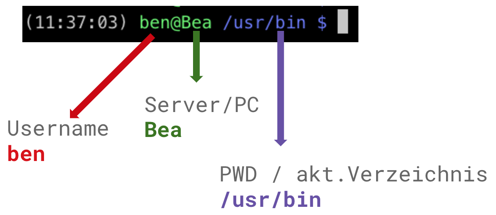
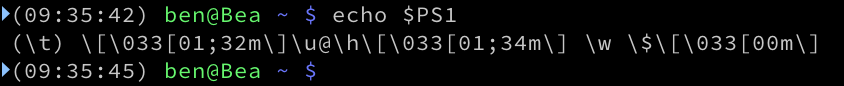
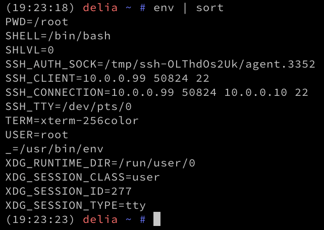

<!-- .slide: class="chapter" -->
# Shell Basics 🐚
<br/><br/>

----

# Command Usage Help/Hints
```bash
$ man <command>
# or
$ <command> -h
# or
$ <command> --help
```

### Example for `cp` command
```bash
$ man cp
# or
$ cp -h
# or
$ cp --help
```

**The *$* is not part of the command!** <!-- .element: style="line-height: 3em;" -->

----

# Bash Prompt
 <!-- .element: class="plain"  style="width: 90%" -->

notes:
* root /, slash als trenner
* aufgebaut als tree / hierarchisch


----

# Bash Prompt
 <!-- .element: class="plain" -->

notes:
* root /, slash als trenner
* aufgebaut als tree / hierarchisch

----

# `$PS1`
 <!-- .element: class="plain" -->

----

<!-- .slide: class="paths" -->
## Environment Variables

* **`$HOME`** - Path of Home directory
* **`$PWD`** & **`$OLDPWD`** - (old) current directory
* **`$PS1`** - Shell Prompt Configuration
* **`$USER`** - Logged in User
* **`$SHELL`** - Used Shell


----

<!-- .slide: class="commands" -->
## Environment Variables

* **`env`**<br/>Shows all currently set/active variables
* **`env | sort`**<br/>...sorted by name
* **`echo $VAR`**<br/>Outputs the content of `$VAR`
* **`export WE="Zoi"`**<br/>Set Variable `$WE` to *Zoi*


----

<!-- .slide: class="commands demo" -->
## Environment Variables
###  <!-- .element: class="plain" -->

----

<!-- .slide: class="commands" -->
## Basic commands

* **`echo $VAR > file.txt`**<br/>Outputs the content of `$VAR`
* **`echo "String Hello" > newFile.c`**<br/>Outputs the content of `$VAR`
 - - -
* **`cd /home/user`**<br/>Change to `/home/user` directory
 - - -
* **`cat file.txt`**<br/>Shows all currently set/active variables
 - - -
* **`touch <file>`**<br/>Shows all currently set/active variables

----

<!-- .slide: class="paths" -->
## $PATH

Directories to search for binaries to execute

* **`$HOME`** - Path of Home directory