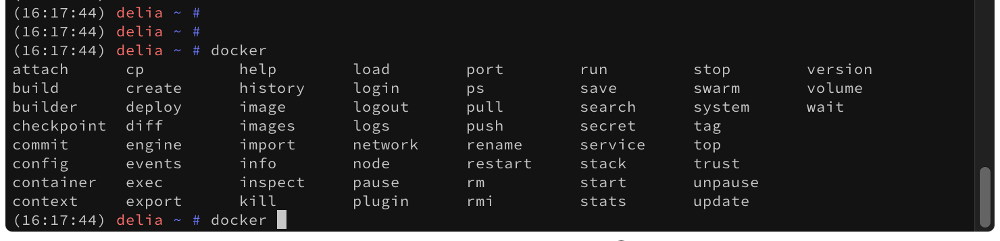
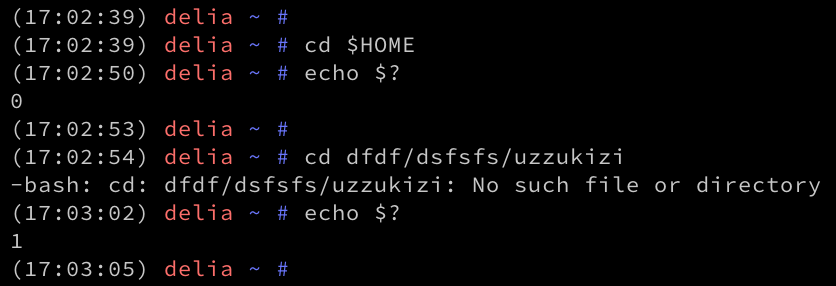

# 🧙 Shell Magic ✨

----

<!-- .slide: class="bulletpoints" -->
# Completion
* *TAB* Key completes your commands if possible
* Works also for **Paths** or **Subcommands** if a *Bash Completion* file is available
 <!-- .element: class="plain" -->
* **`docker`**, **`kubectl`**, **`helm`**, ...

----

# History

* Use it as a logbook of your commands
* Gets **more valuable every day**

```bash
# history configuration
export HISTTIMEFORMAT='%Y-%m-%d %H:%M:%S: '
export HISTFILESIZE=10000000
export HISTSIZE=500000
# avoid duplicate entries
HISTCONTROL="erasedups:ignoreboth"
# ignored commands
export HISTIGNORE="&:[ ]*:exit:bg:fg:history"
# append to the history file, don't overwrite it
shopt -s histappend
# save multi-line commands as one command
shopt -s cmdhist
# record each line as it gets issued
PROMPT_COMMAND='history -a'
```

----

# inputrc / readline
* Activate stepping through your history with PageUp/Dn

```bash
# mappings for "page up" and "page down" to step to the beginning/end
# of the history
bind '"\e[5~": beginning-of-history'
bind '"\e[6~": end-of-history'
# alternate mappings for "page up" and "page down" to search the history
bind '"\e[5~": history-search-backward'
bind '"\e[6~": history-search-forward'
```

----

<!-- .slide: class="bulletpoints color-bulletpoints" -->
# Exit Codes
* Some kind of *return value* of a program/command
* Is **`0`** if command completed successfully, **`>0`** otherwise
* Exit Codes **`>0`** describe problems, e.g.
  * Exit Code **`5`** could mean **file not found**
  * Exit Code **`13`** could mean **connection refused**
* Can *and should!* be used to check if everything went well before doing something

<small>See also [Advanced Bash-Scripting Guide - Reference Cards](http://tldp.org/LDP/abs/html/refcards.html)</small>

notes:
* no convention
* exit code X can mean different things when thrown by different commands
----

# Special Variables 
* Most useful in Scripts, e.g. checking *exit codes*
* **`$?`** shows the exit code of the last run program

See also [Advanced Bash-Scripting Guide - Reference Cards](http://tldp.org/LDP/abs/html/refcards.html)

 <!-- .element: class="plain" -->


----

<!-- .slide: class="bulletpoints color-bulletpoints" -->
# && and ||
* also known as boolean operators or *AND* and *OR*
* important concept you will use every day 😉

#### Scripting / One-Liner
```bash
# touch myhome.txt if successfully changed to $HOME
cd $HOME && touch myhome.txt
````
```bash
# change to /backup if changing to $HOME fails
cd $HOME || cd /backup
```

notes:
* `;` used to simple split commands

----

<!-- .slide: class="bulletpoints" -->
## Parameter Substitution & Expansion

```bash
$ export TEST="hallo welt" && echo ${TEST}
hallo welt
$ echo ${TEST/al/ex}
hexlo welt
$ echo ${TEST#ha}
llo welt
$ echo ${TEST^}
Hallo welt
$ echo ${TEST^^}
HALLO WELT
```

See also [Advanced Bash-Scripting Guide - Reference Cards](http://tldp.org/LDP/abs/html/refcards.html)

----

<!-- .slide: class="bulletpoints color-bulletpoints" -->
## stdin, stdout, stderr

#### In general, every shell has 3 *channels*

* **`stdout`** / **`1`** is the *output in the shell*
  * e.g. typing **`ls`** shows you the directory content printed to **`stdout`**
* **`stdin`** is the *input via shell*
  * remember the *Here Document*, you pasted a multiline string to **`stdin`** of your shell
* **`stderr`** / **`2`** special channel for error output
  * can be redirected to a separate, error-only logfile for example

<small>See also [Advanced Bash-Scripting Guide - All about redirection](http://tldp.org/HOWTO/Bash-Prog-Intro-HOWTO-3.html)</small>

----

<!-- .slide: class="bulletpoints color-bulletpoints" -->
## Pipe `|` and Redirects `>`

As we have seen, **`<<`** and **`>>`** can be used to redirect output to a file

* Write the path of your home directory to a file
```bash
echo $HOME >> my_home.txt
```

<small>See also [Advanced Bash-Scripting Guide - All about redirection](http://tldp.org/HOWTO/Bash-Prog-Intro-HOWTO-3.html)</small>

----

<!-- .slide: class="bulletpoints color-bulletpoints" -->
## Pipe `|` and Redirects `>`, `>>`

As mentioned before, we can also redirect just a specific channel

* Redirect errors from **`grep`** to a dedicated file
```bash
grep "eeX.*" /var/* 2> grep-err.txt
```

<small>See also [Advanced Bash-Scripting Guide - All about redirection](http://tldp.org/HOWTO/Bash-Prog-Intro-HOWTO-3.html)</small>

----

<!-- .slide: class="bulletpoints color-bulletpoints" -->
## Pipe `|` and Redirects `>`, `>>`
And there is also the *Pipe* - **`|`** - to chain commands in another way

* **`cmdA | cmdB`**<br/>*connects*<br/>[**`stdout`** of **`cmdA`**] to [**`stdin`** of **`cmdB`**]

<small>See also [Advanced Bash-Scripting Guide - All about redirection](http://tldp.org/HOWTO/Bash-Prog-Intro-HOWTO-3.html)</small>

----

<!-- .slide: class="bulletpoints color-bulletpoints" -->
## Pipe `|` and Redirects `>`, `>>`
* Pipe your matches to **`uniq`** to remove any duplicates 🤭
```bash
$ cat tinder_matches.csv | uniq
```

* Dirty Hack - simulating a file for **`cat`**
```bash
$ cat <(echo $USER)
```

<small>See also [Advanced Bash-Scripting Guide - All about redirection](http://tldp.org/HOWTO/Bash-Prog-Intro-HOWTO-3.html)</small>

----

<!-- .slide: class="chapter" -->
# Demo! 🤓💻
## Get your most used commands
#### ... <span>|</span> `history` <span>|</span> `awk` <span>|</span> `sort` <span>|</span> `uniq` <span>|</span>  `head` <span>|</span> `bars` <span>|</span> ...

notes:
`history | awk '{print $4}' | sort | uniq -c | sort -nr | head -n 30 | bars`
